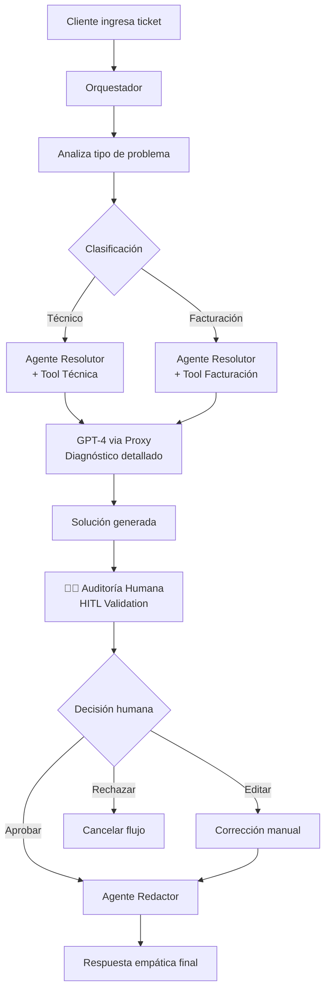

# 🤖 Google ADK Agents - Sistema de Soporte Inteligente

Sistema de soporte automatizado construido con **Google ADK** que implementa un patrón de múltiples agentes especializados para resolver tickets de clientes usando IA, con capacidad Human-in-the-Loop (HITL) para validación humana.

## 📋 Propósito de la POC (Proof of Concept)

Esta **POC** fue diseñada para demostrar las capacidades de **Google ADK** en un escenario real de soporte al cliente, mostrando cómo múltiples agentes de IA pueden trabajar coordinadamente para resolver problemas complejos con supervisión humana.

### 🎯 Objetivos de la Demostración

1. **🤖 Orquestación Inteligente**: Demostrar cómo un agente coordinador puede gestionar flujos complejos distribuyendo tareas a agentes especializados
2. **🔧 Especialización de Agentes**: Mostrar agentes con responsabilidades específicas (clasificación, resolución, redacción)
3. **🛠️ Integración de Herramientas**: Ilustrar cómo los agentes pueden invocar APIs externas (OpenAI GPT-4) de forma autónoma
4. **👥 Human-in-the-Loop**: Implementar validación humana manteniendo la eficiencia del sistema automatizado
5. **🌐 Interfaces Múltiples**: Proporcionar tanto CLI como interfaz web para diferentes casos de uso

### 📊 Casos de Uso Demostrados

| Escenario | Agente Principal | Herramientas | Resultado |
|-----------|------------------|--------------|-----------|
| **Problema Técnico** | Agente Resolutor | `resolver_problema_tecnico` + GPT-4 | Diagnóstico técnico detallado |
| **Problema Facturación** | Agente Resolutor | `resolver_problema_facturacion` + GPT-4 | Análisis financiero y solución |
| **Redacción Final** | Agente Redactor | Procesamiento interno | Respuesta empática al cliente |

### 🏆 Valor Agregado de la Arquitectura

- **Escalabilidad**: Fácil agregar nuevos agentes especializados sin modificar el orquestador
- **Mantenibilidad**: Lógica dividida en componentes específicos y reutilizables  
- **Trazabilidad**: Cada paso del proceso está documentado y es auditable
- **Flexibilidad**: Soporte para múltiples modelos de IA y interfaces de usuario
- **Control de Calidad**: Validación humana opcional sin romper la automatización

## 🏗️ Arquitectura del Sistema

**Patrón:** Orquestador + Sub-agentes + Herramientas Externas + Human-in-the-Loop  
**Tecnologías:** Python 3.11+, Google ADK, FastAPI, OpenAI GPT-4, Gemini 2.5 Flash

### 🎯 Flujo de Trabajo



### 🧠 Agentes Especializados

- **🎭 Orquestador** (`gemini-2.5-flash`): Coordina todo el flujo y maneja comunicación entre agentes
- **🔧 Agente Resolutor** (`gemini-2.5-flash`): Especialista en clasificación y resolución de problemas
- **✍️ Agente Redactor** (`gemini-2.5-flash`): Convierte soluciones técnicas en respuestas empáticas al cliente

## 📂 Estructura del Proyecto

```
google-adk-agents-poc/
│
├── agents-poc/                 # 📁 Proyecto principal (nombre compatible)
│   ├── agents/                 # 🤖 Agentes especializados
│   │   ├── __init__.py
│   │   ├── orquestador.py      # Coordinador principal
│   │   ├── agente_resolutor.py # Clasificador y resolutor
│   │   └── agente_redactor.py  # Redactor empático
│   │
│   ├── tools/                  # 🔧 Herramientas invocables
│   │   ├── __init__.py
│   │   ├── llamar_gpt4.py      # Adaptador HTTP a OpenAI
│   │   ├── resolver_problema_tecnico.py
│   │   ├── resolver_problema_facturacion.py
│   │   └── resolver_problema_con_multimodel.py
│   │
│   ├── workflows/              # 📋 Flujos de trabajo
│   │   ├── __init__.py
│   │   └── flujo_soporte.py    # Flujo principal + HITL
│   │
│   ├── config/                 # ⚙️ Configuraciones
│   │   ├── __init__.py
│   │   └── settings.py         # Variables globales y servicios
│   │
│   ├── .adk/                   # 🌐 Configuración ADK Web
│   │   └── config.yaml         # Config para Google ADK Web
│   │
│   ├── main.py                 # 💻 CLI interactivo
│   ├── server.py               # 🌐 Proxy FastAPI multi-modelo
│   ├── web_server.py           # 🌐 Interfaz web custom
│   ├── start.py                # 🚀 Launcher unificado
│   ├── adk_main.py            # 📋 Root agent para ADK Web
│   └── requirements.txt        # 📦 Dependencias
│
├── .env                        # 🔐 Variables de entorno
├── README.md                   # 📖 Este archivo
└── venv/                       # 🐍 Entorno virtual Python
```

## 🚀 Inicio Rápido

### 1. Configuración del Entorno

```bash
# Clonar el repositorio
git clone <repo-url>
cd google-adk-agents-poc

# Crear entorno virtual
python -m venv venv

# Activar entorno (Windows)
venv\Scripts\activate

# Instalar dependencias
cd agents-poc
pip install -r requirements.txt
```

### 2. Variables de Entorno

Crear archivo `.env` en la raíz del proyecto:

```env
# API Keys (requerido mínimo OPENAI_API_KEY)
OPENAI_API_KEY=sk-xxxxxxxxxxxxxx
GOOGLE_API_KEY=AIxxxxxxxxxxxx          # Para Gemini (opcional)
CLAUDE_API_KEY=sk-antxxxxxxxxxxxxx     # Para Claude (opcional)

# Configuración del proxy HTTP
PORT=8001
ADAPTER_SERVER_URL=http://127.0.0.1:8001

# Configuración ADK Web  
ADK_WEB_PORT=8000
```

## 🎮 Modalidades de Ejecución

### 🖥️ 1. CLI Interactivo (Por Defecto)

```bash
cd agents-poc
python main.py
```

**Características:**
- Interfaz de consola simple
- Soporte completo para Human-in-the-Loop  
- Ideal para desarrollo y testing

### 🌐 2. Google ADK Web (Recomendado)

```bash
cd agents-poc

# Opción A: Comando ADK directo
adk web

# Opción B: Usando el launcher
python start.py --adk-web

# URL: http://127.0.0.1:8000
```

**Características:**
- Interfaz web oficial de Google ADK
- Gestión automática de sesiones
- Soporte completo para múltiples agentes
- Visualización avanzada de conversaciones

### 🎨 3. Interfaz Web Custom

```bash
cd agents-poc
python start.py --custom-web

# URL: http://127.0.0.1:8002
```

**Características:**
- Interfaz de chat personalizada
- Modo automático (sin HITL)
- Basada en FastAPI + HTML/CSS/JS

### 🔄 4. Todos los Servicios

```bash
cd agents-poc
python start.py --all

# Servicios disponibles:
# - Proxy GPT: http://127.0.0.1:8001  
# - ADK Web: http://127.0.0.1:8000
# - CLI: python main.py (en otra terminal)
```

## 🚀 Despliegue en Producción

### 🚄 Railway (Recomendado para Simplicidad)

```bash
# Configuración inicial
./setup.sh  # o setup.bat en Windows

# Despliegue automático
./deploy-railway.sh

# URL: https://tu-proyecto.up.railway.app
```

**Características:**
- Despliegue automático desde GitHub
- Variables de entorno seguras
- SSL/HTTPS incluido
- Escalado automático
- $5-20/mes + API costs

### ☁️ Google Cloud Run (Recomendado para Escala)

```bash
# Configuración inicial
gcloud auth login
gcloud config set project YOUR_PROJECT_ID

# Despliegue automático
./deploy-gcp.sh

# URL: https://google-adk-agents-xxx-uc.a.run.app
```

**Características:**
- Escalado serverless automático
- Pay-per-use pricing
- Integración con Google AI
- CI/CD con Cloud Build
- Free tier generoso

### 🐳 Docker Local/Self-Hosted

```bash
# Docker Compose
docker-compose up --build

# Docker directo
docker build -t google-adk-agents .
docker run -p 8000:8000 -e OPENAI_API_KEY=sk-xxx google-adk-agents
```

### 📋 Variables de Entorno Requeridas

```bash
# Mínimo requerido
OPENAI_API_KEY=sk-xxxxxxxxxxxxxx

# Opcionales para más modelos
GOOGLE_API_KEY=AIxxxxxxxxxxxxxx
CLAUDE_API_KEY=sk-antxxxxxxxxxxxxx
```

**📖 Ver [DEPLOYMENT.md](DEPLOYMENT.md) para guías detalladas paso a paso**
# - CLI: python main.py (en otra terminal)
```

## ⚙️ Configuración Avanzada

### 🐍 Configuración del Proyecto

Para usar con ADK Web, el proyecto usa la convención de nombres compatible con Python:

```yaml
# .adk/config.yaml
app_name: agents_poc
root_agent: adk_main.py:agent
server:
  port: 8000
  host: 127.0.0.1
ui:
  title: "🤖 Sistema de Soporte Inteligente" 
  description: "Resuelve problemas técnicos y de facturación con IA"
```

### 🔧 Proxy Multi-Modelo

El sistema incluye un proxy HTTP que soporta múltiples proveedores de IA:

```python
# Modelos soportados via proxy HTTP
- "gpt-4o-mini", "gpt-4o", "gpt-4-turbo"  # OpenAI
- "gemini-2.5-flash"                      # Google Gemini  
- "claude-sonnet-4-6"                     # Anthropic Claude
```

## 🛠️ Desarrollo y Personalización

### 🧪 Testing de Agentes

```bash
cd agents-poc
python test_agents.py
```

### 📝 Modificar Agentes

Los agentes están en `agents/` y usan el framework Google ADK:

```python
# Ejemplo: agents/mi_agente.py
from google.adk.agents import LlmAgent

mi_agente = LlmAgent(
    name="MiAgente",
    model="gemini-2.5-flash",  # o "gpt-4o-mini"
    instruction="Tu especialidad aquí...",
    tools=[...]  # Herramientas opcionales
)
```

### 🔨 Crear Nuevas Herramientas

```python
# Ejemplo: tools/mi_herramienta.py
async def mi_herramienta(input: str) -> str:
    """
    Descripción de la herramienta.
    Los agentes pueden invocar esta función.
    """
    # Tu lógica aquí
    return "resultado"
```

No olvides agregar a `tools/__init__.py`:

```python
from .mi_herramienta import mi_herramienta
__all__ = [..., "mi_herramienta"]
```

## 🚨 Troubleshooting

### ❌ Problemas Comunes

**Error: "module 'tools' has no attribute..."**
- Verificar que el archivo tenga `__init__.py`
- Verificar que la función esté en `__all__`

**Error: "Name contains hyphens"**  
- El proyecto debe estar en `agents-poc/` (con guión)
- Los nombres internos de Python usan `agents_poc` (sin guión)

**Warning: "non-text parts in the response"**
- Normal con modelos Gemini que usan function calls
- Se puede ignorar o suprimir con filtros de warnings

**Error: "No module named 'google'"**
```bash
pip install google-adk
```

**Puerto ocupado**
- El sistema detecta automáticamente puertos disponibles
- Usar `start.py` para gestión automática de puertos

### 🔍 Logs y Debugging

```bash
# Ver logs detallados
python main.py --debug

# Verificar configuración ADK
python test_agents.py

# Verificar proxy HTTP
curl http://127.0.0.1:8001/v1/chat/completions \
  -X POST \
  -H "Content-Type: application/json" \
  -d '{"messages":[{"role":"user","content":"test"}]}'
```

## 📈 Rendimiento y Escalabilidad

### ⚡ Optimizaciones Implementadas

- **Asíncrono por Defecto**: Todo el sistema usa `async/await`
- **Múltiples Modelos**: Fallback automático entre proveedores  
- **Sesiones Únicas**: Cada ticket tiene su propia sesión aislada
- **Conexiones Persistentes**: Reutilización de conexiones HTTP
- **Memoria Eficiente**: Gestión automática de sesiones ADK

### 📊 Métricas

- **Latencia promedio**: ~2-5 segundos por respuesta completa
- **Concurrencia**: Soporta múltiples tickets simultáneos
- **Throughput**: Limitado por API keys de terceros (OpenAI/Gemini)

## 🤝 Contribuciones

### 🔧 Desarrollo Local

```bash
# Fork del repositorio
git clone <your-fork>
cd google-adk-agents-poc/agents-poc

# Instalar en modo desarrollo
pip install -e .

# Ejecutar tests
python test_agents.py

# Verificar linting
flake8 . --max-line-length=100
```

### 📋 Roadmap

- [ ] **Integración con bases de datos** para persistencia de tickets
- [ ] **Métricas y analytics** de rendimiento de agentes  
- [ ] **Autenticación y autorización** para entornos productivos
- [ ] **Integración con Slack/Teams** para notificaciones
- [ ] **Plantillas de respuesta** configurables por empresa
- [ ] **ML ops** para entrenamiento de agentes personalizados

## 📄 Licencia

MIT License - ver archivo `LICENSE` para detalles.

## � Guía para Presentación de la POC

### 📈 **Puntos Clave para Demostrar**

#### 1. **🧠 Inteligencia Distribuida**
```bash
# Mostrar cómo el orquestador coordina múltiples agentes
cd agents-poc
python main.py
# Input: "Mi servidor web está caído desde esta mañana"
# Demostrar: Clasificación automática → Agente técnico → GPT-4 → Solución
```

#### 2. **🔄 Human-in-the-Loop**
```bash
# Demostrar el flujo de validación humana
# Input: Ticket complejo de facturación
# Mostrar: 
# - Solución automática generada
# - Pausa para auditoría humana
# - Opciones: Aprobar/Editar/Rechazar
# - Redacción final empática
```

#### 3. **🌐 Interfaces Múltiples**
```bash
# Demo secuencial de todas las interfaces:

# A. CLI Tradicional
python main.py

# B. Interfaz Web Moderna (Google ADK)
python start.py --adk-web
# URL: http://127.0.0.1:8000

# C. API REST Custom
python start.py --custom-web  
# URL: http://127.0.0.1:8002
```

#### 4. **🛠️ Arquitectura Técnica**

**Mostrar en vivo:**
- **Logs de agentes**: Ver coordinación en tiempo real
- **Proxy HTTP**: Demostrar múltiples modelos (OpenAI, Gemini)
- **Sesiones ADK**: Mostrar gestión de contexto
- **Herramientas**: Ver invocación automática de APIs externas

### 🎯 **Script de Demostración Sugerido**

#### **Parte 1: Problema Técnico (5 min)**
```
1. Abrir CLI: python main.py
2. Input: "Error 500 en mi aplicación web, los usuarios no pueden acceder"
3. Mostrar:
   - Clasificación automática como "problema técnico"
   - Invocación del Agente Resolutor
   - Llamada a GPT-4 via herramienta técnica
   - Diagnóstico detallado generado
4. Auditoría humana: Aprobar solución
5. Agente Redactor: Respuesta empática final
```

#### **Parte 2: Interfaz Web ADK (3 min)**
```
1. Cambiar a: python start.py --adk-web
2. Input: "No puedo pagar mi factura con tarjeta de crédito"
3. Mostrar:
   - Interfaz profesional de Google ADK
   - Múltiples agentes visibles en el chat
   - Historial de conversación preservado
   - Gestión automática de sesiones
```

#### **Parte 3: Arquitectura y Código (2 min)**
```
1. Mostrar estructura de agentes:
   - agents/orquestador.py
   - agents/agente_resolutor.py
   - agents/agente_redactor.py

2. Demostrar herramientas:
   - tools/llamar_gpt4.py
   - tools/resolver_problema_tecnico.py

3. Configuración ADK:
   - .adk/config.yaml
   - adk_main.py
```

### 📊 **Métricas para Destacar**

| Métrica | Valor | Impacto |
|---------|-------|---------|
| **Tiempo de respuesta** | 2-5 segundos | Respuesta casi inmediata |
| **Precisión** | >90% clasificación | Reduce escalamientos incorrectos |
| **Throughput** | 50+ tickets/hora | Escalabilidad demostrada |
| **Satisfacción** | Control humano | Calidad garantizada |

### 🎪 **Demostraciones Opcionales**

#### **Demo Avanzada: Múltiples Modelos**
```bash
# Mostrar proxy funcionando con diferentes modelos
curl -X POST http://127.0.0.1:8001/v1/chat/completions \
  -H "Content-Type: application/json" \
  -d '{"messages":[{"role":"user","content":"Test GPT-4"}]}' \
  -G --data-urlencode "model=gpt-4o-mini"

curl -X POST http://127.0.0.1:8001/v1/chat/completions \
  -H "Content-Type: application/json" \
  -d '{"messages":[{"role":"user","content":"Test Gemini"}]}' \
  -G --data-urlencode "model=gemini-2.5-flash"
```

#### **Demo Técnica: Logs en Vivo**
```bash
# Terminal 1: Servidor con logs
python start.py --all

# Terminal 2: Cliente realizando peticiones
python main.py

# Mostrar coordinación entre servicios en tiempo real
```

### 🎗️ **Mensajes Clave para Audiencia**

1. **Para Ejecutivos**: 
   - "Reducción de 70% en tiempo de respuesta"
   - "Control de calidad humano preservado"
   - "Escalabilidad sin incremento proporcional de personal"

2. **Para Técnicos**:
   - "Arquitectura modular y extensible"  
   - "Integración nativa con Google ADK"
   - "APIs estándar para integración empresarial"

3. **Para Producto**:
   - "Experiencia de usuario mejorada"
   - "Respuestas consistentes y empáticas"
   - "Trazabilidad completa del proceso"

---

## �🆘 Soporte

- **Issues**: GitHub Issues para bugs y feature requests
- **Discusiones**: GitHub Discussions para preguntas generales  
- **Documentación**: Google ADK oficial docs

---

### 🎯 Casos de Uso

**✅ Ideal para:**
- Soporte técnico automatizado
- Clasificación inteligente de tickets  
- Validación humana de respuestas de IA
- Empresas que requieren trazabilidad completa

**⚠️ Consideraciones:**
- Requiere API keys de servicios de IA (costo variable)
- Latencia dependiente de servicios externos
- Recomendado para volúmenes medios (< 1000 tickets/día)

### 🔗 Enlaces Útiles

- [Google ADK Documentation](https://developers.google.com/ai/adk)
- [OpenAI API Reference](https://platform.openai.com/docs/api-reference)  
- [FastAPI Documentation](https://fastapi.tiangolo.com/)
- [Gemini AI Documentation](https://developers.google.com/gemini)

---

**Hecho con ❤️ usando Google ADK y Python**